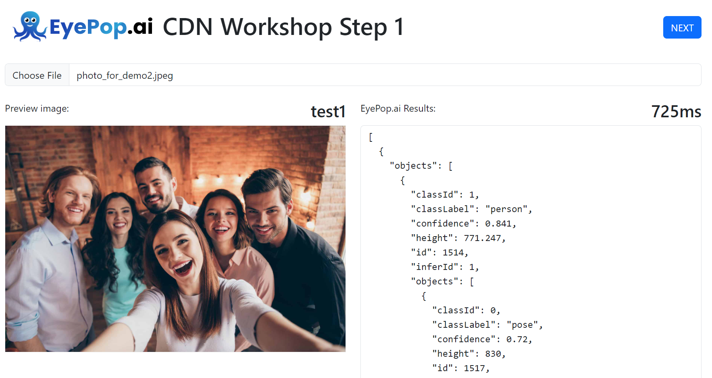
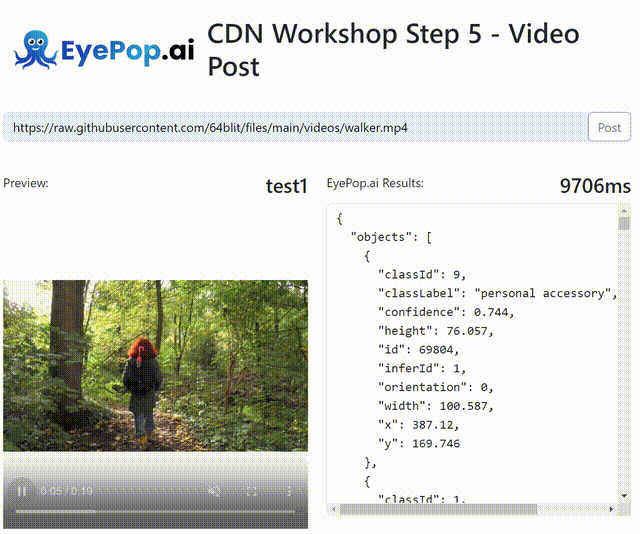
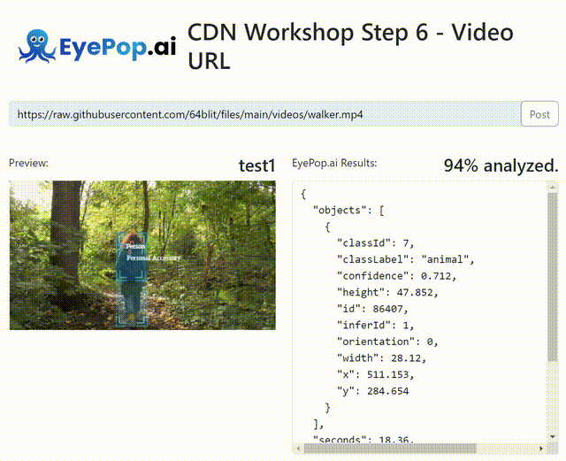

## 🌍 AI CDN 🔗

---

### Getting started

- Log into your EyePop account at https://dashboard.eyepop.ai/sign-in
- Create your own **API Pop** and select _Live - People and Common Object_ from the object library
- Check out the **API Info** section of your Pop and copy'n paste the endpoint`and`Auth Token`into`config.js` of your local copy of this repo.

### Need a Web Server locally to test?

- Easiest: [Web based IDE](https://replit.com/)
- Option 1) Python: `python3 -m http.server 9001`
- Option 2) [LiveServer Extension to VS Code](https://marketplace.visualstudio.com/items?itemName=ritwickdey.LiveServer)

Start your web server from within this directory and check out the examples: http://localhost:9001/1_upload_image.html

---

## Overview

### 1. Image Upload

File: [1_upload_image.html](./1_upload_image.html)

**_Description:_**
This is a basic example of how to use the EyePopSDK to upload an image to the EyePop API. It handles the process of selecting an image file, sending it to the API, and receiving the response.

### 2. Image Response Parsing

File: [2_parse_results.html](./2_parse_results.html)

**_Description:_**
This demo takes the response from the EyePop API (from the image upload) and parses the results. It demonstrates how to navigate the response object and extract useful information.

### 3. Visualize Results

File: [3_visualize_results.html](./3_visualize_results.html)

**_Description:_**
This demo visualizes the results from the EyePop API. It uses the parsed results from 2_parse_results.html and creates a visual representation of the data.

### 4. Add Rules to Results

File: [4_add_rules_to_results.html](./4_add_rules_to_results.html)

**_Description:_**
This demo adds rules to the results from the EyePop API. It demonstrates how to use the EyePopSDK to add rules to the parsed results, which can be used to further analyze or filter the prediction data.

### 5. Video Upload

File: [5_video_upload.html](./5_video_upload.html)

**_Description:_**
This demo demonstrates how to use the EyePopSDK to upload a video to the EyePop API. It handles the process of selecting a video file, sending it to the API, and receiving the response.

### Video Upload with Visualization

File: [6_video_url.html](./6_video_url.html)

**_Description:_**
This demo shows how to handle video URLs with the EyePop API. It demonstrates how to send a video URL to the API and receive the response. It also showcases how to use the EyePopSDK to draw people's poses and bounding boxes around them.

Each of these scripts provides a practical example of how to use the EyePopSDK with the EyePop API. They can be used as a starting point for developing your own applications with the EyePop API.
