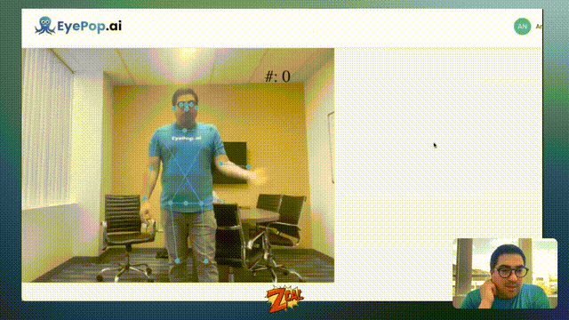

## 🏋️ Fitness Rep Counter 🏋️



### Getting Start

- Log into your EyePop account at https://dashboard.eyepop.ai/auth/sign-in
- Create your own **API Pop** and select _Live - People and Common Object_ from the object library
- Check out the **API Info** section of your Pop and copy'n paste the `endpoint` and `Auth Token` into `config.js` of your local copy of this repo.

### Need a Web Server locally to test?

- Easiest: [Web based IDE](https://replit.com/)
- Option 1) Python: `python3 -m http.server 9001`
- Option 2) [LiveServer Extension to VS Code](https://marketplace.visualstudio.com/items?itemName=ritwickdey.LiveServer)

Start your web server from within this directory of this example and check out the examples: http://localhost:9001/index.html

---

### Overview

This demo uses a simple Low Code Language to perform fitness rep counting of a live streamed webcam with the EyePop SDK.

EyePop makes this incredibly simple by incrementing a counter when **_all_** event sequences specified below (seperated by a "\r\n") are detected.

```
Biggest Person left wrist below Biggest Person left elbow
Biggest Person right wrist below Biggest Person right elbow
Biggest Person left wrist above Biggest Person left elbow
Biggest Person right wrist above Biggest Person right elbow
```

To enable drawing and the counter, we add the following:

```
config.draw = [
    // This draws a box over all detected objects
    {"type": "box", "targets":["*"]},

    // This draws the pose lines for all detected people
    { "type": "pose", "targets": ["person"] },

    // This manages incrememnting a counter when the rules are observed
    {
        "type": "counter", "RulesLowCode": "Biggest Person left wrist below Biggest Person left elbow" + "\r\n" +
        "Biggest Person right wrist below Biggest Person right elbow" + "\r\n" +
        "Biggest Person left wrist above Biggest Person left elbow" + "\r\n" +
        "Biggest Person right wrist above Biggest Person right elbow"
    }
];

```

Also, note that we need the folow elements for the EyePopSDK:

- The `myLocalVideo` element is a video element used for our webcam.
- The `previewcanvas` element is a canvas used for displaying the captured video frame.
- The `mobilecanvas` element is a canvas used for drawing ontop of the video.
